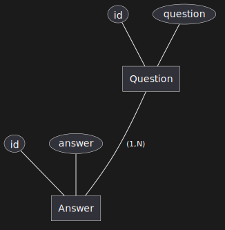
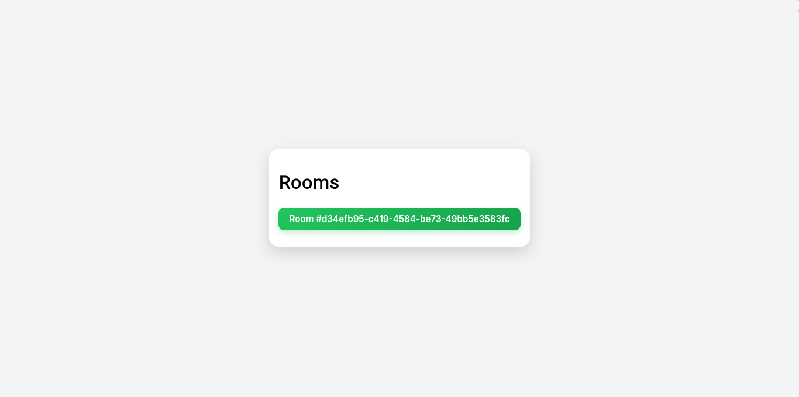
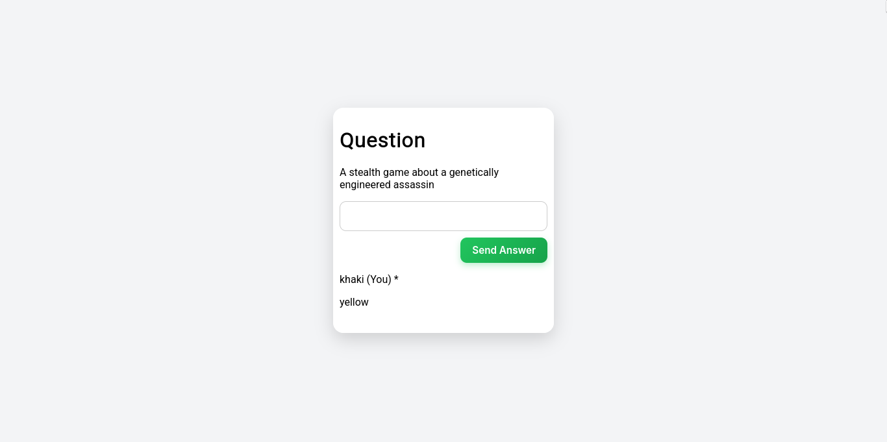
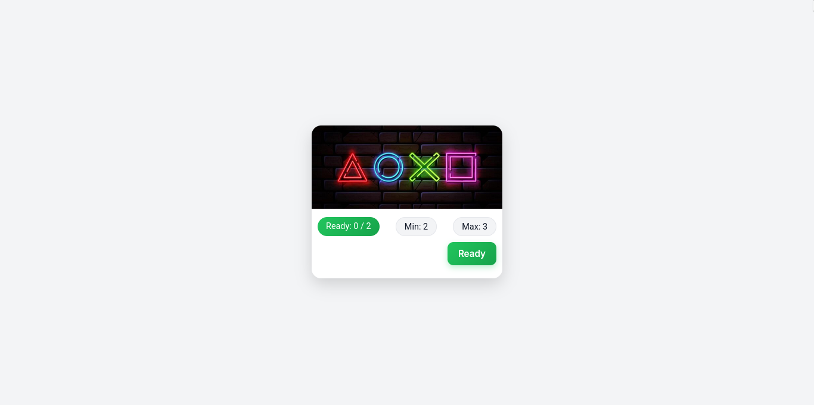
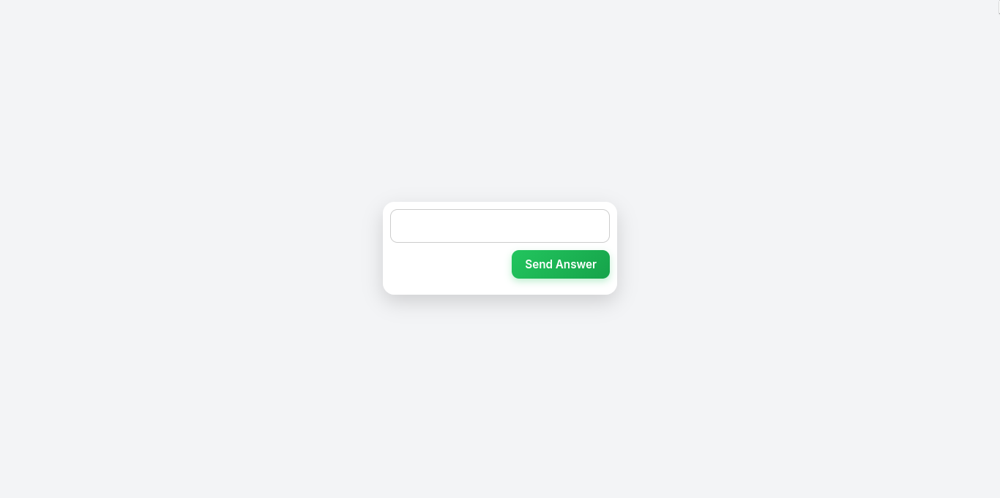
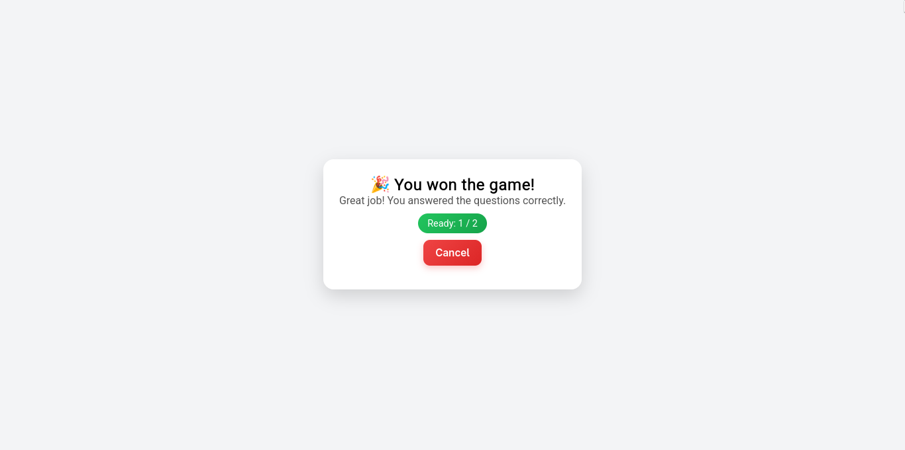

# Gamedle in GO
This project is a browser-based game inspired by GameDle. Unlike the original, which relies on images,
this version provides clues through concise textual descriptions. To foster a competitive atmosphere,
the system is built with WebSockets, enabling real-time bidirectional communication. This allows players
to monitor their opponents' progress instantly within the same session.

## Technologies
* GO
* Vite
* React
* TypeScript

## Database Diagram


## Messages
Clients and the server interact via a standardized message protocol. Below is an example
of the message structure exchanged between them:

```go
type Message struct {
	Cmd     string          `json:"cmd"`
	Payload json.RawMessage `json:"payload"`
}

type GuessMsg struct {
	Answer string `json:"answer"`
}
```

The `Payload` of a `Message` object contains specific command data encoded in raw JSON. It is
the responsibility of the receiver to unwrap this payload and execute the appropriate logic.
For instance, if a client sends a `GuessMsg`, the server evaluates the answer. The server then
sends direct feedback back to the player and broadcasts their updated progress to all other clients
in the room, dynamically updating everyone's UI.

## Rotas de backend
* **`GET /`**: Returns a list of all active rooms currently on the server.
* **`POST /create`**: Creates a new room on the server and returns its generated ID in the response.
* **`GET /ws?roomId={}&playerId={}`**: Establishes a WebSocket connection to the specified `roomId`.
It either adds a new player with a randomly generated ID, or resumes an existing player's session if
a valid `playerId` is provided and they are currently disconnected.
* **`GET /validate?roomId={}&playerId={}`**: Validates whether a user can join the room as the specified player.
Returns a `200 OK` status if successful, or a non-200 status code along with an error message if the request is denied.

## Screenshots





